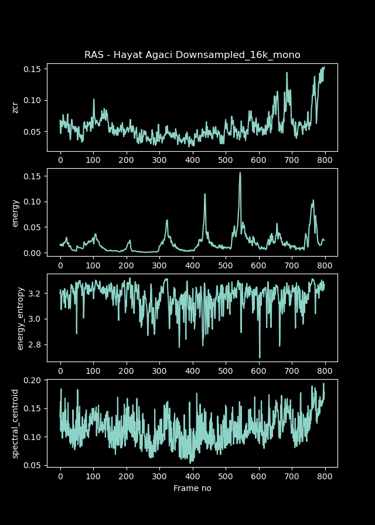

# Tree of Life GANs

> Performed in Zorlu PSM, Istanbul. 16th of September, 2022.

Below you can find the techniques and data used in the Tree of Life audio/visual performance in collaboration with [Fazıl Say](https://en.wikipedia.org/wiki/Faz%C4%B1l_Say), [Jamal Aliyev](https://en.wikipedia.org/wiki/Jamal_Aliyev) and [Zorlu PSM](https://en.wikipedia.org/wiki/Zorlu_PSM).

At the same time, we share [the StyleGAN-2 model](#gans-model-weights), which has been trained with 65 million nature and tree images, as open source.

## Latent Walk GAN Browser

With the latent gan browser, you can see how synthetically produced images are created.

Optical flow pipeline diagram of synthetic images

## UMAP

60 million classified and cleared visual umap algorithms are positioned in a 3-dimensional space.

 

### High Res Full Video

If you want to view the full video in high resolution, you can visit the video below.

## GANs Model Weights

The weights of the model trained in StyleGAN-2 can be downloaded from [the link](https://www.dropbox.com/s/hzjhki4mypljilo/00044-NatureTrees-mirror-stylegan2-gamma10-noaug-resumecustom_network-snapshot-019456.pkl?dl=0)

## Audio Analysis

Some examples of sound analyzes made for a small part of the works are shown below.

## VVVV Pipeline

> Performed in Zorlu PSM, Istanbul. 16th of September, 2022.
